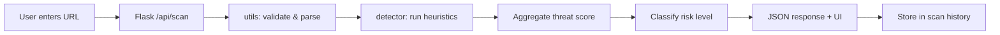

# PhishShield

**PhishShield** is a lightweight phishing URL detection web application that analyzes links using heuristic-based threat scoring. It helps users quickly assess whether a URL shows common signs of phishing—without requiring machine learning models or external threat-intelligence APIs.

Built as a cybersecurity mini-project with **Python Flask**, a modular backend, and a responsive web interface.

---


## Overview

Phishing attacks often rely on deceptive URLs: fake login pages, IP-based hosts, long obfuscated links, and urgency keywords. PhishShield inspects submitted URLs against a set of **rule-based heuristics**, assigns a **threat score from 0 to 100**, classifies **risk level**, and explains **why** each flag was raised.

| Aspect | Detail |
|--------|--------|
| **Type** | Web application (single-page UI + REST API) |
| **Analysis** | Heuristic / rule-based (no ML in v1) |
| **Backend** | Python 3.10+, Flask |
| **Frontend** | HTML, CSS, vanilla JavaScript |
| **Data storage** | In-memory scan history (resets on server restart) |

---

## Features

### Core detection

- **HTTPS validation** — flags URLs that do not use encrypted HTTPS
- **Suspicious keyword detection** — matches common phishing terms in the URL string
- **IP-based URL detection** — identifies hosts that use IPv4/IPv6 instead of domain names
- **Long URL detection** — scores unusually long links
- **Special character analysis** — detects high ratios of non-standard characters
- **Domain randomness analysis** — Shannon entropy, digit density, hyphens, long subdomains
- **`@` symbol detection** — URLs that may hide the real destination after `@`
- **Double-slash path check** — suspicious patterns in the URL path

### Application

- **Threat score (0–100)** with capped aggregation across rules
- **Five-tier risk classification** — Safe, Low, Medium, High, Critical
- **Reason-based findings** — each rule explains what triggered and its score contribution
- **Responsive web UI** — dark theme, score ring, findings list
- **Recent scan history** — last 10 scans with timestamps (click to re-view)
- **JSON API** — programmatic scanning via `POST /api/scan`

---

## Technology stack

| Component | Technology | Purpose |
|-----------|------------|---------|
| Backend | Python, Flask 3.x | HTTP server, routes, JSON API |
| Detection engine | Custom `detector.py` | Heuristic analysis & scoring |
| URL parsing | `validators`, `urllib.parse` | Validation & normalization |
| Domain parsing | `tldextract` | Subdomain / registered domain extraction |
| Frontend | HTML5, CSS3, JavaScript | User interface (no framework) |
| Fonts | Google Fonts (DM Sans, JetBrains Mono) | Typography |
| Deployment (recommended) | Render, Railway, Gunicorn | Production hosting |

### Python dependencies

```
flask>=3.0.0
validators>=0.22.0
tldextract>=5.1.0
```

---

## How it works



1. User submits a URL through the web form or API.
2. `utils.py` normalizes the URL (adds `http://` if missing) and validates format.
3. `detector.py` runs each heuristic rule and sums contributing scores (max 100).
4. Risk level is mapped from score ranges defined in `config.py`.
5. Findings with `score > 0` are returned to the client.
6. Valid scans are stored in an in-memory history list (newest first, limit 10).

---

## Project structure

```
PhishShield/
├── app.py                 # Flask application, routes, scan history
├── detector.py            # Heuristic engine & threat scoring
├── utils.py               # URL normalization, validation, entropy helpers
├── config.py              # Keywords, thresholds, risk level definitions
├── requirements.txt       # Python dependencies
├── .gitignore             # Excludes venv, cache, secrets
├── README.md              # This file
├── LICENSE                # MIT License
├── docs/
│   ├── ARCHITECTURE.md    # Module design & data flow
│   └── API.md             # Full API specification
├── templates/
│   └── index.html         # Main scan page
└── static/
    ├── style.css          # UI styles (responsive, dark theme)
    └── script.js          # Scan form, API calls, history panel
```

### Module responsibilities

| File | Role |
|------|------|
| `app.py` | Defines `/`, `/api/scan`, `/api/history`; manages in-memory history |
| `detector.py` | `analyze_url()`, rule checks, `ScanResult` / `Finding` dataclasses |
| `utils.py` | `normalize_url()`, `is_valid_url()`, `parse_url()`, `shannon_entropy()` |
| `config.py` | Tunable thresholds, keyword list, risk level color/label map |

See [docs/ARCHITECTURE.md](docs/ARCHITECTURE.md) for deeper design notes.

---

## Installation

### Prerequisites

- **Python 3.10 or newer** ([python.org](https://www.python.org/downloads/))
- **pip** (included with Python)
- Optional: **Git** for version control and GitHub upload

### Step-by-step (Windows)

```powershell
# Clone or navigate to the project
cd path\to\psh

# Create virtual environment
python -m venv venv

# Activate (PowerShell)
.\venv\Scripts\Activate.ps1

# Install dependencies
pip install -r requirements.txt

# Run the development server
python app.py
```

### Step-by-step (macOS / Linux)

```bash
cd path/to/psh
python3 -m venv venv
source venv/bin/activate
pip install -r requirements.txt
python app.py
```

Open **http://127.0.0.1:5000** in your browser.

The server runs with `debug=True` on `0.0.0.0:5000` by default (see `app.py`).

---

## Usage

### Web interface

1. Open the app in a browser.
2. Paste or type a URL (e.g. `https://example.com` or `example.com`).
3. Click **Scan URL**.
4. Review the **threat score**, **risk badge**, and **analysis details**.
5. Use **Recent scans** on the right to revisit previous results (same session).

### Example URLs to test

| URL | Expected behavior |
|-----|-------------------|
| `https://www.google.com` | Low score — HTTPS, clean domain |
| `http://192.168.1.1/login-verify` | High score — no HTTPS, IP host, keywords |
| `https://secure-paypal-login-verify-account.example.com` | Elevated — multiple keywords |
| `not a url` | Validation error, no score |

### Command-line (Python)

```python
from detector import analyze_url

result = analyze_url("http://192.168.0.1/account/login")
print(result.threat_score, result.risk_label)
for f in result.findings:
    print(f"  [{f.score}] {f.description}")
```

---

## Threat scoring & risk levels

Individual rules add points to a **total threat score**. The total is **capped at 100**. Multiple rules can fire on the same URL.

| Score range | Level | Label | Color |
|-------------|-------|-------|-------|
| 0 – 24 | `safe` | Safe | Green |
| 25 – 44 | `low` | Low Risk | Lime |
| 45 – 64 | `medium` | Medium Risk | Amber |
| 65 – 84 | `high` | High Risk | Orange |
| 85 – 100 | `critical` | Critical | Red |

> **Note:** A high score means the URL matches **suspicious patterns**, not that it is confirmed malicious. Always verify with official sources and security tools.

---

## Detection rules (detailed)

| Rule ID | Check | Max contribution | Trigger condition |
|---------|-------|------------------|-------------------|
| `https` | Protocol | 20 | Scheme is not `https` |
| `keywords` | Phishing terms | 25 | Any keyword from `config.SUSPICIOUS_KEYWORDS` in URL (score scales with match count) |
| `ip_domain` | Host type | 25 | Hostname is IPv4 or IPv6 |
| `url_length` | Length | 20 | Full URL length > 75 characters |
| `special_chars` | Obfuscation | 15 | Special character ratio > 15% |
| `domain_randomness` | Domain shape | 20 | High entropy (≥ 4.2), ≥30% digits, ≥2 hyphens, or subdomain > 20 chars |
| `at_symbol` | Credential hiding | 15 | `@` present in URL |
| `double_slash` | Path trick | 10 | `//` in path segment |

### Suspicious keywords (configurable)

Defined in `config.py`: `login`, `verify`, `secure`, `account`, `update`, `banking`, `password`, `confirm`, `wallet`, `signin`, `suspend`, `urgent`, `credential`, `paypal`, `amazon`, `microsoft`, `appleid`, `free`, `winner`, `claim`, `refund`, `invoice`, `billing`.

### Tunable thresholds (`config.py`)

| Setting | Default | Meaning |
|---------|---------|---------|
| `MAX_URL_LENGTH` | 75 | Characters before length rule applies |
| `MAX_SPECIAL_CHAR_RATIO` | 0.15 | 15% non-alphanumeric (excluding `.`, `-`, `_`, `/`) |
| `MAX_DOMAIN_ENTROPY` | 4.2 | Shannon entropy threshold for domain label |
| `RECENT_SCANS_LIMIT` | 10 | Max entries in scan history |

---

## API reference

Summary below; full specification in [docs/API.md](docs/API.md).

### `POST /api/scan`

Analyze a URL.

**Request (JSON):**

```json
{
  "url": "http://192.168.1.1/login-verify-account"
}
```

**Success response (200):**

```json
{
  "url": "http://192.168.1.1/login-verify-account",
  "threat_score": 73,
  "risk_level": "high",
  "risk_label": "High Risk",
  "risk_color": "#f97316",
  "is_valid": true,
  "error": null,
  "findings": [
    {
      "rule": "https",
      "description": "URL does not use HTTPS encryption",
      "score": 20
    }
  ]
}
```

**Invalid URL:**

```json
{
  "is_valid": false,
  "error": "Invalid URL format. Please enter a valid link.",
  "threat_score": 0
}
```

### `GET /api/history`

Returns up to 10 recent valid scans (in-memory).

```json
{
  "scans": [
    {
      "url": "...",
      "threat_score": 73,
      "risk_level": "high",
      "scanned_at": "2026-05-17T12:00:00+00:00",
      "findings": []
    }
  ]
}
```

### `GET /`

Serves the main HTML interface.

---

## Configuration

Edit `config.py` to customize:

- Keyword list for phishing terms
- Risk level score boundaries and UI colors
- URL length and entropy thresholds
- History list size

No environment variables are required for local development. For production, set `FLASK_ENV=production` and disable debug mode in `app.py` or use a WSGI server.

---

## Deployment

### Render / Railway

1. Push the repository to GitHub.
2. Create a new **Web Service**.
3. **Build command:** `pip install -r requirements.txt`
4. **Start command:** `gunicorn app:app --bind 0.0.0.0:$PORT`

Add to `requirements.txt` for production:

```
gunicorn>=21.0.0
```

### Production checklist

- [ ] Use Gunicorn or Waitress instead of `flask run`
- [ ] Set `debug=False`
- [ ] Use HTTPS on the hosting platform
- [ ] Do not commit `.env` or secrets
- [ ] Consider rate limiting for `/api/scan` in high-traffic deployments

---

## Limitations & disclaimer

PhishShield is an **educational / demonstration tool**. It:

- Does **not** crawl or visit the target URL
- Does **not** use blocklists, ML models, or threat feeds
- Can produce **false positives** (legitimate sites with long paths or keywords)
- Can produce **false negatives** (sophisticated phishing on clean-looking URLs)
- Stores history **in memory only** (lost on restart)

**Do not rely on this tool as your only security control.** For real protection, use browser safe-browsing, email filtering, and enterprise security products.

---

## Future improvements

Planned enhancements from the project roadmap:

- Machine learning–based phishing detection
- Real-time URL fetching & content analysis
- Browser extension integration
- Persistent database logging
- Admin dashboard for scan analytics
- Public REST API with authentication
- Rate limiting and caching

---

## Resume / portfolio description

> Developed **PhishShield**, a phishing URL detection web application using **Python Flask** with heuristic-based threat analysis. Implemented URL inspection, **HTTPS validation**, **keyword analysis**, **IP-based host detection**, **entropy-based domain scoring**, and a **0–100 threat score** with five risk tiers. Delivered a responsive, modular web interface with scan history and a JSON API suitable for cybersecurity coursework and portfolio demonstration.

---

## Publishing to GitHub

### 1. Install Git

Download [Git for Windows](https://git-scm.com/download/win) and restart your terminal.

### 2. Initialize and commit

```powershell
cd c:\Users\91811\psh
git init
git add .
git commit -m "Initial commit: PhishShield phishing URL detection app"
```

### 3. Create remote repository

**Option A — GitHub CLI**

```powershell
gh auth login
gh repo create PhishShield --public --source=. --remote=origin --push
```

**Option B — Manual**

1. Create a repo at [github.com/new](https://github.com/new) (no README).
2. Push:

```powershell
git remote add origin https://github.com/YOUR_USERNAME/PhishShield.git
git branch -M main
git push -u origin main
```


## License

This project is released under the [MIT License](LICENSE). Free for educational and portfolio use.

---

## Additional documentation

- [Architecture & module design](docs/ARCHITECTURE.md)
- [API specification](docs/API.md)

---

**PhishShield** — Heuristic phishing URL detection for learning and demonstration. 

***PROJECT INTEGRATED WITH AI***
